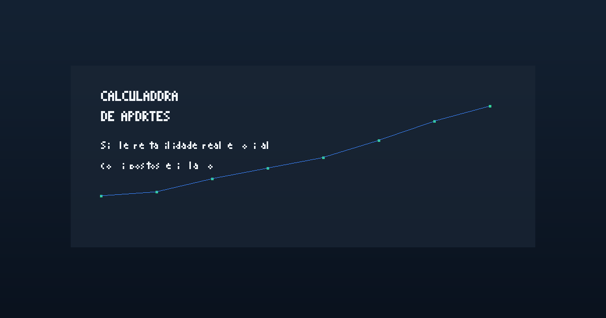

# Rumo ao 1º Milhão 💰 (React + TS)

[](https://github.com/your-org/calculadora-aporte/actions/workflows/ci.yml)

Calculadora simples de aporte mensal para atingir uma meta (default: R$ 1.000.000).

- cenários prontos de rentabilidade (pessimista/base/otimista) + modo personalizado
- sliders de inflação anual e “imposto efetivo” sobre ganhos (aproximação)
- cálculo em **valores reais (R$ de hoje)** (desconta inflação)
- aporte **reajustado pela inflação** vs **nominal fixo**
- aporte no começo ou no fim do mês
- comparação entre cenários
- gráfico de projeção + exportação CSV
- presets salvos no navegador + atalhos de metas (100k / 300k / 1M / 2M)
- exibe a **meta nominal equivalente** no horizonte escolhido
- usa sua **renda mensal informada** (ou a renda do benchmark) para calcular o aporte médio do modelo

> Observação: é um modelo educacional (taxas constantes). Na prática, rentabilidade oscila, impostos variam por produto/prazo e pode haver taxas/custos.

## Screenshot



## Rodar localmente

```bash
npm install
npm run dev
```

## Testes, qualidade e automação

- ESLint + Prettier + EditorConfig
- Type-check com `npm run typecheck`
- Testes de core com Vitest + cobertura (`npm run test`)
- Lint (`npm run lint`) e build (`npm run build`)
- Formatação automática (`npm run format`)
- CI no GitHub Actions executando lint + typecheck + test + build

## Build

```bash
npm run build
npm run preview
```

## Deploy na Vercel

1. Instale as dependências e garanta que o build local funciona:

   ```bash
   npm install
   npm run build
   ```

2. No painel da Vercel, clique em **New Project** e importe este repositório.
3. Use as configurações padrão do Vite:
   - **Framework Preset:** Vite
   - **Build Command:** `npm run build`
   - **Install Command:** `npm install`
   - **Output Directory:** `dist`
4. Conclua o deploy. Para publicar via CLI depois de configurado, use:

   ```bash
   vercel --prod
   ```

## Stack

- React
- TypeScript
- Vite

## Modelagem (resumo)

Rentabilidade mensal bruta → aplica “imposto efetivo” (aprox.) → converte para taxa real descontando inflação.

Se o aporte for “reajustado”: mantém poder de compra constante (cresce nominalmente com inflação).

Se o aporte for “nominal fixo”: o aporte perde poder de compra ao longo do tempo.
